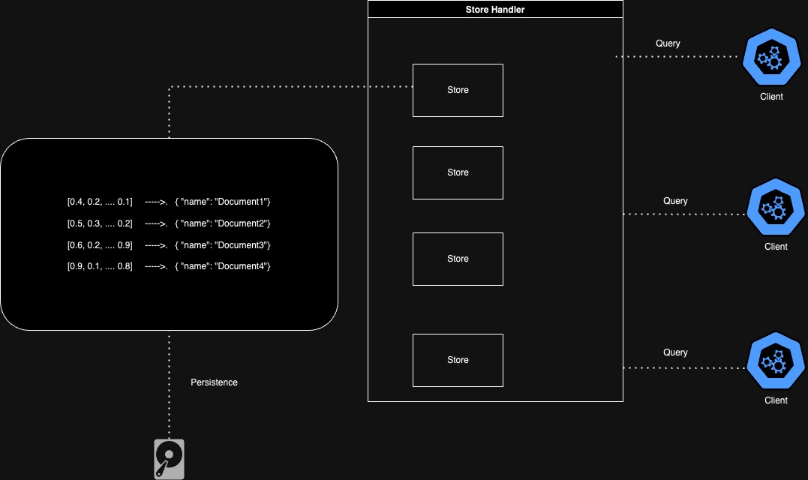

# Ahnlich
<p align="left"></p>

In-memory vector key value store

[](https://github.com/deven96/ahnlich/actions/workflows/test.yml)

ähnlich means similar in german

## Architecture




## Development

### Using Spec documents to interact with Ahnlich DB

To generate the spec documents, run
```bash
cargo run --bin typegen generate
```
It is worth noting that any changes to the types crate, requires you to run the above command. This helps keep our spec document and types crate in sync.

To Convert spec documents to a programming language, run:

```bash
 cargo run --bin typegen create-client <Programming Language>
```
Available languages are:
- python
- golang
- typescript.

In order to communicate effectively with the ahnlich db, you would have to extend the bincode serialization protocol automatically provided by `serde_generate`.
Your message(in bytes) should be serialized and deserialized in the following format => `AHNLICH_HEADERS` + `VERSION` + `QUERY/SERVER_RESPONSE`. Bytes are `Little Endian`.


## How Client Releases Work

The clients follow a similar process when deploying new releases.
[Example with python client](https://github.com/deven96/ahnlich/blob/main/sdk/ahnlich-client-py/README.md#deploy-to-artifactory).


## Docker Images.

`Note`: Arguments and commands must be passed in quotes. E.G: `docker run <image_name> "ahnlich-db run --enable-tracing --port 8000"`
