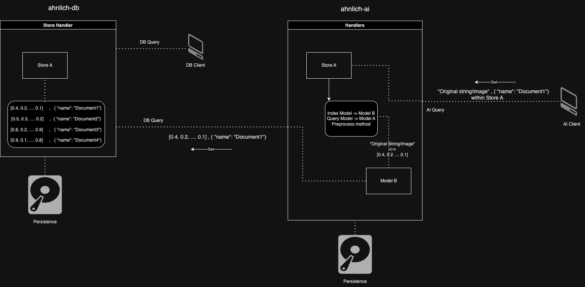

# Ahnlich
<p align="left"></p>

[](https://github.com/deven96/ahnlich/actions/workflows/test.yml)

⚠️ **Note:** Ahnlich is not production-ready yet and is still in **testing** and so might experience breaking changes.

 "ähnlich" means similar in german. It comprises of multiple tools for usage and development such as:

- [`ahnlich-db`](ahnlich/db): In-memory vector key value store for storing embeddings/vectors with corresponding metadata(key-value maps). It's a powerful system which enables AI/ML engineers to store and search similar vectors using linear (cosine, euclidean) or non-linear similarity (kdtree) algorithms. It also leverages search within metadata values to be able to filter out entries using metadata values. A simple example can look like
```
GETSIMN 2 WITH [0.2, 0.1] USING cosinesimilarity IN my_store WHERE (page != hidden)

// example query
get_sim_n(
    store="my_store",
    search_input=[0.2, 0.1],
    closest_n=2,
    algorithm=CosineSimilarity,
    condition=Predicate::NotEquals{
      key="page",
      value="hidden",
  },
)
```
- [`ahnlich-ai`](ahnlich/ai/): AI proxy to communicate with `ahnlich-db`, receiving raw input, transforming into embeddings, and storing within the DB. It extends the capabilities by then allowing developers/engineers to issue queries to the same store using raw input such as images/text. It features multiple off-the-shelf models that can be selected for store index and query.
```
CREATESTORE my_store QUERYMODEL all-minilm-l6-v2 INDEXMODEL all-minilm-l6-v2

// example query
create_store(
    store="my_store",
    index_model="all-minilm-l6-v2",
    query_model="all-minilm-l6-v2",
)
```
- [`ahnlich-client-rs`](ahnlich/client/): Rust client for `ahnlich-db` and `ahnlich-ai`.
- [`ahnlich-client-py`](sdk/ahnlich-client-py/): Python client for `ahnlich-db` and `ahnlich-ai`.

- [`ahnlich-cli`](ahnlich/cli/): CLI for querying `ahnlich-db` and `ahnlich-ai`


## Architecture




## Usage

`ahnlich-db`, `ahnlich-ai` and `ahnlich-cli` are packaged and released as [binaries](https://github.com/deven96/ahnlich/releases) for multiple platforms alongside [docker images](https://github.com/deven96?tab=packages&repo_name=ahnlich)

The DB can be used without the AI proxy for more fine grained control of the generated vector embeddings as all clients support both

### Docker Images.

`Note`: 
1. Arguments and commands must be passed in quotes. E.G: `docker run <image_name> "ahnlich-db run --enable-tracing --port 8000"`

2. The CLI comes packaged into the docker images.

---

### Installation  

#### Download Binaries  

You can download the Ahnlich binaries for `ai` and `db` from [GitHub Releases](https://github.com/deven96/ahnlich/releases).  

- **`wget`:**  
  ```bash  
  wget https://github.com/deven96/ahnlich/releases/download/bin%2Fdb%2F0.0.0/aarch64-darwin-ahnlich-db.tar.gz  
  ```  

- **Extract the file:**  
  ```bash  
  tar -xvzf aarch64-darwin-ahnlich-db.tar.gz  
  ```  

- **Run the binary:**  
  ```bash  
  ./ahnlich-db  
  ```  

Replace `aarch64-darwin-ahnlich-db.tar.gz` with the appropriate file name for your architecture. For `ai`, download the corresponding `ai` binary, extract it, and run it using `./ahnlich-ai`.  

---

#### Using Docker  

You can pull the prebuilt Docker images for Ahnlich:  

- **Ahnlich AI**:  
  ```bash  
  docker pull ghcr.io/deven96/ahnlich-ai:latest  
  ```  

- **Ahnlich DB**:  
  ```bash  
  docker pull ghcr.io/deven96/ahnlich-db:latest  
  ```  

---

#### Example Docker Compose  

Below is an example `docker-compose.yaml` configuration to run both `ahnlich-db` and `ahnlich-ai` with tracing:  

```yaml   
services:
  ahnlich_db:
    image: ghcr.io/deven96/ahnlich-db:latest
    command: >
      "ahnlich-db run --host 0.0.0.0 \
      --enable-tracing \
      --otel-endpoint http://jaeger:4317"
    ports:
      - "1369:1369"

  ahnlich_ai:
    image: ghcr.io/deven96/ahnlich-ai:latest
    command: >
      "ahnlich-ai run --db-host ahnlich_db --host 0.0.0.0 \
      --supported-models all-minilm-l6-v2,resnet-50 \
      --enable-tracing \
      --otel-endpoint http://jaeger:4317"
    ports:
      - "1370:1370"

  # optional jaeger service whenever --enable-tracing and
  # --otel-endpoint is used
  jaeger:
    image: jaegertracing/all-in-one:${JAEGER_VERSION:-latest}
    ports:
      - "16686:16686"
      - "1888:1888" # pprof extension
      - "8888:8888" # Prometheus metrics exposed by the collector
      - "8889:8889" # Prometheus exporter metrics
      - "4317:4317" # otlp grpc
      - "4318:4318" # otlp http
```

Below is an example `docker-compose.yaml` configuration with persistence:

```yaml

services:
  ahnlich_db:
    image: ghcr.io/deven96/ahnlich-db:latest
    command: >
      "ahnlich-db run --host 0.0.0.0 \
      --enable-persistence --persist-location /root/.ahnlich/data/db.dat \
      --persistence-interval 300"
    ports:
      - "1369:1369"
    volumes:
      - "./data/:/root/.ahnlich/data" # Persistence Location

  ahnlich_ai:
    image: ghcr.io/deven96/ahnlich-ai:latest
    command: >
      "ahnlich-ai run --db-host ahnlich_db --host 0.0.0.0 \
      --supported-models all-minilm-l6-v2,resnet-50 \
      --enable-persistence --persist-location /root/.ahnlich/data/ai.dat \
      --persistence-interval 300"
    ports:
      - "1370:1370"
    volumes:
      - "./ahnlich_ai_model_cache:/root/.ahnlich/models" # Model cache storage
      - "./data/:/root/.ahnlich/data" # Persistence Location

```

### Execution Providers (Ahnlich AI)

`CUDA`: Only supports >= CUDAv12 and might need to `sudo apt install libcudnn9-dev-cuda-12`
`CoreML (Apple)`: Not advised for NLP models due to often large dimensionality.

### Contributing

View [contribution guide](CONTRIBUTING.md)
