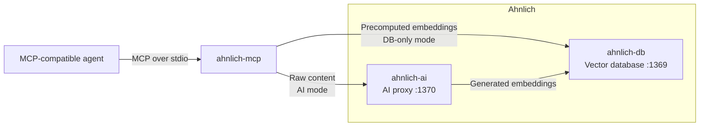

# Ahnlich MCP

An MCP server that exposes the [Ahnlich](https://ahnlich.dev/) vector database
to MCP-compatible agents. It provides tools for store management, text
embedding, semantic search, metadata filtering, and data management.

## Architecture


```mermaid
flowchart LR
    Agent["MCP-compatible agent"]
    MCP["ahnlich-mcp"]

    subgraph Ahnlich
        AI["ahnlich-ai<br/>AI proxy :1370"]
        DB["ahnlich-db<br/>Vector database :1369"]
    end

    Agent -->|"MCP over stdio"| MCP
    MCP -->|"Precomputed embeddings<br/>DB-only mode"| DB
    MCP -->|"Raw content<br/>AI mode"| AI
    AI -->|"Generated embeddings"| DB
```

Users can connect directly to Ahnlich DB when they generate embeddings
themselves, or use Ahnlich AI to embed raw content before storing it in the
database.

## Requirements

- [uv](https://docs.astral.sh/uv/)
- Docker with Docker Compose
- Python 3.11, managed by uv

## Quickstart

```bash
docker compose up -d
uv sync
uv run ahnlich-mcp
```

## MCP client configuration

```json
{
  "mcpServers": {
    "ahnlich": {
      "command": "uv",
      "args": [
        "--directory",
        "/absolute/path/to/ahnlich/mcp",
        "run",
        "ahnlich-mcp"
      ]
    }
  }
}
```

Use the absolute path returned by `which uv` as `command` if the MCP client
cannot find `uv`.

## Configuration

| Variable | Default | Description |
|---|---:|---|
| `AHNLICH_DB_HOST` | `127.0.0.1` | Ahnlich DB host |
| `AHNLICH_DB_PORT` | `1369` | Ahnlich DB port |
| `AHNLICH_AI_HOST` | `127.0.0.1` | Ahnlich AI proxy host |
| `AHNLICH_AI_PORT` | `1370` | Ahnlich AI proxy port |

## Tools

| Tool | Description |
|---|---|
| `ping` | Check DB and AI proxy connectivity |
| `server_info` | Get AI proxy information |
| `create_store` | Create a text vector store |
| `list_stores` | List stores |
| `drop_store` | Delete a store and its data |
| `store_content` | Embed and store text with metadata |
| `upsert_content` | Insert or update content |
| `similarity_search` | Search by semantic similarity |
| `get_by_metadata` | Retrieve entries by metadata |
| `delete_by_metadata` | Delete entries by metadata |
| `create_predicate_index` | Index metadata keys |
| `drop_predicate_index` | Remove metadata indexes |

## Development

```bash
uv sync
docker compose up -d
uv run pytest tests/ -v
```

Run the MCP Inspector:

```bash
npx -y @modelcontextprotocol/inspector uv --directory "$(pwd)" run ahnlich-mcp
```

## Documentation

- [Ahnlich documentation](https://ahnlich.dev/docs/overview)
- [Model Context Protocol](https://modelcontextprotocol.io/)
- [uv documentation](https://docs.astral.sh/uv/)

## License

MIT
