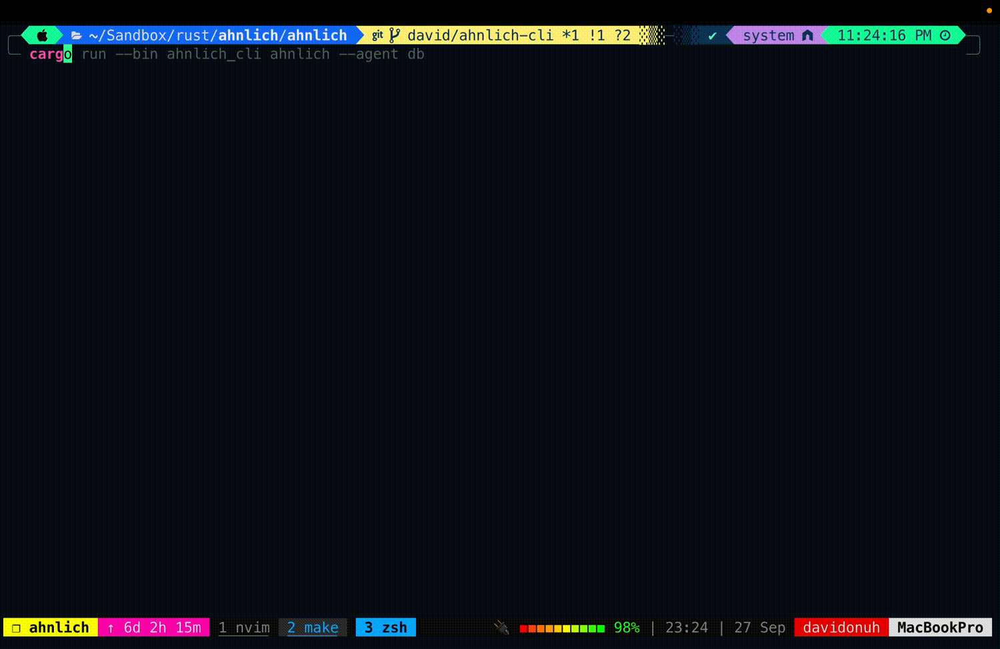

# Ahnlich CLI Documentation

The Ahnlich CLI enables users to query AI and DB binaries using a custom Domain-Specific Language (DSL). This document provides usage instructions, commands, and examples to help you integrate the CLI with your projects.



## Installation

To install the Ahnlich CLI, follow these steps:
```bash
# Download the binary from github releases
```

## Running the CLI

To run the Ahnlich CLI, use the following command format:
```bash
ahnlich-cli ahnlich --agent <agent> --host <host> --port <port>
```
- **Agent**: Binary to connect to (either `ai` or `db`)
- **Host**: Defaults to `127.0.0.1`
- **Port**: Defaults based on the selected agent. (`AI = 1370`, `DB = 1369`)

### Example Usage

#### Connect to DB Agent
```bash
ahnlich_cli ahnlich --agent db --host 127.0.0.1 --port 1369
```

#### Connect to AI Agent
```bash
ahnlich_cli ahnlich --agent ai --host 127.0.0.1 --port 1370
```

## Querying the DB

The CLI accepts a range of commands for database operations. Commands are written in the following format:

```bash
<COMMAND> <ARGS> IN <STORE>
```

### Example DB Commands

1. **Create a Store**  
   ```bash
   CREATESTORE test_store DIMENSION 2 PREDICATES (author, country)
   ```

2. **Insert Data into a Store**  
   ```bash
   SET (([1.0, 2.1], {name: Haks, category: dev}), ([3.1, 4.8], {name: Deven, category: dev})) in test_store
   ```

3. **Retrieve Data from a Store**  
   ```bash
   GETKEY ([1.0, 2.0], [3.0, 4.0]) IN test_store
   ```

### Combining Multiple Commands

You can combine commands using a semicolon `;` delimiter:

```bash
GETKEY ([1.0, 2.0], [3.0, 4.0]) IN test_store; CREATEPREDINDEX (name, category) in test_store
```

### List of Supported DB Commands

- `PING`
- `LISTCLIENTS`
- `LISTSTORES`
- `INFOSERVER`
- `DROPSTORE store_name IF EXISTS`
- `CREATEPREDINDEX (key_1, key_2) in store_name`
- `GETSIMN 4 WITH [vector] USING cosinesimilarity IN store_name WHERE (predicate)`
- And more...

## Querying AI Binaries

The CLI also supports AI binary queries.

### Example AI Commands

1. **Create a Store for AI**  
   ```bash
   CREATESTORE my_store QUERYMODEL dalle3 INDEXMODEL dalle3 PREDICATES (author, country) NONLINEARALGORITHMINDEX (kdtree)
   ```

2. **Insert AI Data**  
   ```bash
   SET (([This is the life of Haks], {name: Haks, category: dev}), ([This is the life of Deven], {name: Deven, category: dev})) in store
   ```

3. **Query AI Data**  
   ```bash
   GETSIMN 4 WITH [random text] USING cosinesimilarity IN store_name WHERE (author = dickens)
   ```

### List of Supported AI Commands

- `PING`
- `LISTCLIENTS`
- `LISTSTORES`
- `DROPSTORE store_name IF EXISTS`
- `GETPRED (predicate) IN store_name`
- `CREATENONLINEARALGORITHMINDEX (algorithm) in store_name`
- `GETSIMN 4 WITH [text] USING similarity_algorithm IN store_name`
- And more...