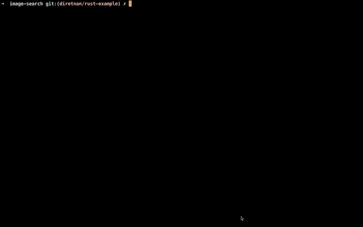

## Image search example for Rust SDK

An example on how to use the rust sdk that shows the process of indexing a couple of images and 
into the db and querying those via text

To install dependencies (ensure you have cargo installed)  
```cargo build```

Place the images into the images folder and run
```cargo run index```


To search run  
```cargo run query```



