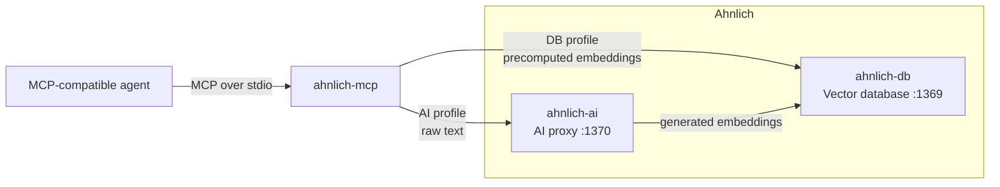

# Ahnlich MCP

An MCP server that exposes [Ahnlich](https://ahnlich.dev/) vector storage and semantic search to MCP-compatible agents.

## Architecture



The `db` profile connects directly to `ahnlich-db` and accepts user-provided embeddings. The `ai` profile sends raw text through `ahnlich-ai`, which generates embeddings and stores them in `ahnlich-db`.

## Requirements

- [uv](https://docs.astral.sh/uv/)
- Docker with Docker Compose
- Python 3.11

## Installation

From the Ahnlich repository:

```bash
cd mcp
uv sync --locked --dev
```

## Profiles

| Profile | Input | Required services |
|---|---|---|
| `db` | Precomputed embeddings | `ahnlich-db` |
| `ai` | Raw text | `ahnlich-ai` and `ahnlich-db` |

The default profile is `ai`.

### DB profile

Start the database:

```bash
docker compose up -d --wait ahnlich_db
```

Check the connection:

```bash
uv run ahnlich-mcp doctor --profile db
```

Start the MCP server:

```bash
uv run ahnlich-mcp --profile db
```

### AI profile

Start the AI proxy and database:

```bash
docker compose up -d --wait
```

Check the connection:

```bash
uv run ahnlich-mcp doctor --profile ai
```

Start the MCP server:

```bash
uv run ahnlich-mcp --profile ai
```

The server uses stdio transport and waits silently for MCP messages. If Ahnlich is unavailable, the server remains running and tool calls return actionable errors.

## MCP client configuration

```json
{
  "mcpServers": {
    "ahnlich": {
      "command": "/absolute/path/to/uv",
      "args": [
        "--directory",
        "/absolute/path/to/ahnlich/mcp",
        "run",
        "ahnlich-mcp",
        "--profile",
        "ai"
      ]
    }
  }
}
```

Find the absolute path to uv with:

```bash
which uv
```

Change the profile argument to `db` to use precomputed embeddings.

## Configuration

Command-line profile selection overrides `AHNLICH_PROFILE`.

| Variable | Default | Description |
|---|---:|---|
| `AHNLICH_PROFILE` | `ai` | Active profile: `ai` or `db` |
| `AHNLICH_DB_HOST` | `127.0.0.1` | Database host |
| `AHNLICH_DB_PORT` | `1369` | Database port |
| `AHNLICH_AI_HOST` | `127.0.0.1` | AI proxy host |
| `AHNLICH_AI_PORT` | `1370` | AI proxy port |
| `AHNLICH_AI_MODEL` | `all-minilm-l6-v2` | Model used by the AI profile |
| `AHNLICH_MCP_READ_ONLY` | `0` | Expose only non-modifying tools |

Supported AI models:

- `all-minilm-l6-v2`
- `all-minilm-l12-v2`
- `bge-base-en-v1.5`
- `bge-large-en-v1.5`
- `jina-embeddings-v2-base-code`

The selected model must also be enabled in `ahnlich-ai` through its `--supported-models` option. The bundled Compose configuration enables `all-minilm-l6-v2`.

Example:

```bash
AHNLICH_PROFILE=db \
AHNLICH_DB_HOST=127.0.0.1 \
AHNLICH_DB_PORT=1369 \
uv run ahnlich-mcp
```

## Read-only mode

Enable strict read-only mode when the MCP client must not modify Ahnlich:

```bash
AHNLICH_MCP_READ_ONLY=1 uv run ahnlich-mcp --profile ai
```

Only these tools are exposed:

- `ping`
- `server_info`
- `list_stores`
- `similarity_search`
- `get_by_metadata`

Mutating tools are omitted from the MCP tool registry.

## Tools

Both profiles expose the same tool names by default. Input schemas differ where embeddings are involved.

| Tool | Description |
|---|---|
| `ping` | Check the configured Ahnlich service |
| `server_info` | Get information about the configured service |
| `create_store` | Create a vector store |
| `list_stores` | List stores |
| `drop_store` | Delete a store and its entries |
| `store_entries` | Store raw text or precomputed embeddings |
| `similarity_search` | Search using raw text or a query embedding |
| `get_by_metadata` | Retrieve entries matching indexed metadata |
| `delete_by_metadata` | Delete entries matching indexed metadata |
| `create_predicate_index` | Index metadata keys |
| `drop_predicate_index` | Remove metadata indexes |

The `db` profile requires `dimension` when creating a store. Its `store_entries` and `similarity_search` tools accept embeddings.

The `ai` profile accepts raw text and uses the configured Ahnlich model to generate embeddings.

Metadata filters use the `metadata_filter` argument. Filtered metadata keys must have predicate indexes.

## Result controls

`list_stores` and `get_by_metadata` accept a `limit` between `1` and `1024`. The default is `50`.

They return a bounded response:

```json
{
  "results": [],
  "truncated": false
}
```

`similarity_search` accepts `top_k` up to `1024`.

Stored embeddings are omitted from DB search and metadata responses by default. Pass `include_embeddings: true` when the vectors are required.

## AI preprocessing

The AI profile supports the following preprocessing modes for `store_entries` and `similarity_search`:

| Value | Behaviour |
|---|---|
| `none` | Send input without model preprocessing |
| `truncate` | Allow Ahnlich to truncate input for the selected model |

The default is `none`.

## Development

Run unit tests:

```bash
uv run pytest tests/unit -v
```

Run integration tests:

```bash
docker compose up -d --wait
uv run pytest tests/integration -v
```

Run the complete test suite:

```bash
uv run pytest -v
```

Run MCP Inspector:

```bash
npx -y @modelcontextprotocol/inspector \
  uv \
  --directory "$(pwd)" \
  run ahnlich-mcp \
  --profile ai
```

## License

MIT