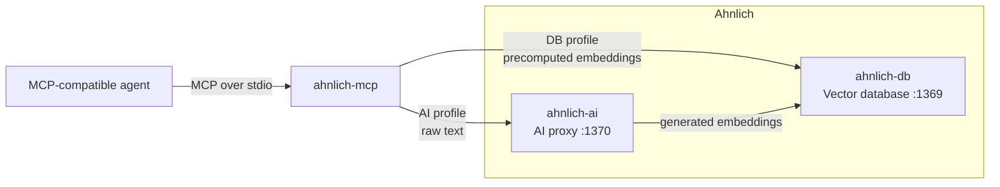

# Ahnlich MCP

An MCP server that exposes [Ahnlich](https://ahnlich.dev/) vector storage and semantic search to MCP-compatible agents.

## Architecture



The `db` profile connects directly to `ahnlich-db` and expects user-provided embeddings. The `ai` profile sends raw text through `ahnlich-ai`, which embeds it and stores the result in `ahnlich-db`.

## Requirements

- [uv](https://docs.astral.sh/uv/)
- Docker with Docker Compose
- Python 3.11

## Installation

### From source

From the Ahnlich repository:

```bash
cd mcp
uv sync --dev
```

## Profiles

| Profile | Input | Required services |
|---|---|---|
| `db` | Precomputed embeddings | `ahnlich-db` |
| `ai` | Raw text | `ahnlich-ai` and `ahnlich-db` |

The default profile is `ai`.

### DB profile

Start only the database:

```bash
docker compose up -d --wait ahnlich_db
```

Check the connection:

```bash
uv run ahnlich-mcp doctor --profile db
```

Start the MCP server:

```bash
uv run ahnlich-mcp --profile db
```

### AI profile

Start the AI proxy and database:

```bash
docker compose up -d --wait
```

Check the connection:

```bash
uv run ahnlich-mcp doctor --profile ai
```

Start the MCP server:

```bash
uv run ahnlich-mcp --profile ai
```

The server uses stdio transport, so it waits silently for MCP messages when started directly. If Ahnlich is unavailable, it logs a warning and keeps running so tool calls can return useful errors.

## MCP client configuration

When running from the repository:

```json
{
  "mcpServers": {
    "ahnlich": {
      "command": "/absolute/path/to/uv",
      "args": [
        "--directory",
        "/absolute/path/to/ahnlich/mcp",
        "run",
        "ahnlich-mcp",
        "--profile",
        "ai"
      ]
    }
  }
}
```

Find the absolute uv path with:

```bash
which uv
```

Change the profile argument to `db` to use precomputed embeddings.

## Configuration

Command-line profile selection overrides `AHNLICH_PROFILE`.

| Variable | Default | Description |
|---|---:|---|
| `AHNLICH_PROFILE` | `ai` | Active profile: `ai` or `db` |
| `AHNLICH_DB_HOST` | `127.0.0.1` | DB host |
| `AHNLICH_DB_PORT` | `1369` | DB port |
| `AHNLICH_AI_HOST` | `127.0.0.1` | AI proxy host |
| `AHNLICH_AI_PORT` | `1370` | AI proxy port |
| `AHNLICH_AI_MODEL` | `all-minilm-l6-v2` | Model configured for the AI profile |
| `AHNLICH_MCP_READ_ONLY` | `0` | Expose only tools that do not modify Ahnlich |

The AI profile supports `all-minilm-l6-v2`, `all-minilm-l12-v2`,
`bge-base-en-v1.5`, `bge-large-en-v1.5`, and
`jina-embeddings-v2-base-code`.

The selected model must also be enabled in `ahnlich-ai` through its
`--supported-models` option. The bundled Compose configuration enables only
`all-minilm-l6-v2`.

For example:

```bash
AHNLICH_PROFILE=db \
AHNLICH_DB_HOST=127.0.0.1 \
AHNLICH_DB_PORT=1369 \
uv run ahnlich-mcp
```

## Tools

Both profiles expose the same tool names. Input schemas change where embeddings are involved.

| Tool | Description |
|---|---|
| `ping` | Check the configured Ahnlich service |
| `server_info` | Get information about the configured service |
| `create_store` | Create a vector store |
| `list_stores` | List stores |
| `drop_store` | Delete a store and its entries |
| `store_entries` | Store raw text or precomputed embeddings |
| `similarity_search` | Search using raw text or a query embedding |
| `get_by_metadata` | Retrieve entries matching metadata |
| `delete_by_metadata` | Delete entries matching metadata |
| `create_predicate_index` | Index metadata keys |
| `drop_predicate_index` | Remove metadata indexes |

The `db` profile requires `dimension` when creating a store. Its `store_entries` and `similarity_search` tools accept embeddings.

The `ai` profile accepts raw text and uses the configured Ahnlich model to generate embeddings.

## Development

Run unit tests without Ahnlich:

```bash
uv run pytest tests/unit -v
```

Run integration tests with Ahnlich:

```bash
docker compose up -d --wait
uv run pytest tests/integration -v
```

Run the full suite:

```bash
uv run pytest -v
```

Run MCP Inspector:

```bash
npx -y @modelcontextprotocol/inspector \
  uv \
  --directory "$(pwd)" \
  run ahnlich-mcp \
  --profile ai
```

## License

MIT