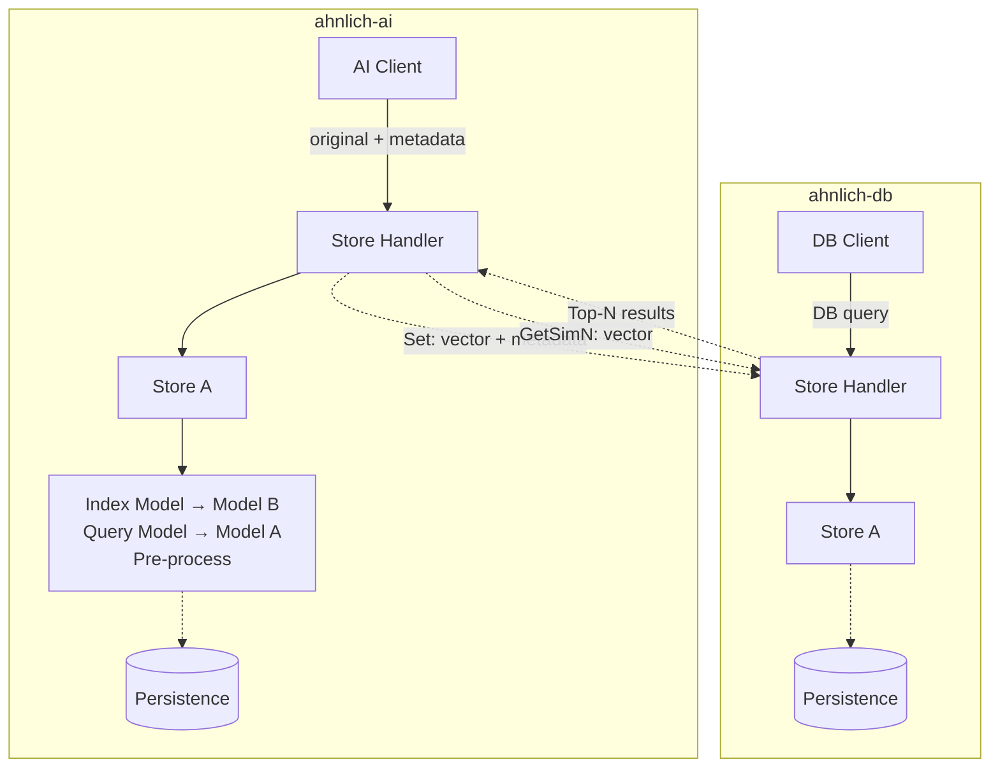

# Ahnlich Architecture V2
**Status**: *Alpha / testing – subject to breaking changes.***

Ahnlich is split into two independent, network‑accessible services that work in tandem:

- ahnlich‑ai – **the Intelligence Layer**
- ahnlich‑db – **the Vector Store Layer**

Clients can speak to either layer through gRPC/HTTP or the bundled CLI/SDKs. The AI layer adds automated embedding and model management on top of the raw vector store exposed by the DB layer.

## 📦 1.  High‑Level Design

### Analogy to Kafka
| Kafka | Ahnlich | 
| ----- | ----- |
| **Producer** | AI Client / DB Client | 
| **Broker** | ahnlich‑ai & ahnlich‑db services | 
| **Topic / Partition** | Store (logical namespace) |
| **Message** | Vector + metadata |
| **Consumer** | Client fetching GetSimN |

## 2. Key Components
### 2.1  `ahnlich‑ai` – Intelligence Layer
| Sub‑component | Responsibility | 
| ----- | ----- |
| **AI Client API** | External gRPC/HTTP endpoints – accepts raw documents (text, images…) & metadata. |
| **Store Handler** | Maps incoming requests to a Store; maintains per‑store configuration (models, preprocess pipeline). | 
| **Store** | Logical namespace. Each holds a pair of ONNX models (Index & Query) plus preprocessing logic. | 
| **Model Node** | Executes preprocessing → model inference → produces embedding. |
| **Optional Persistence** | Periodic snapshots of store metadata & model cache to disk. |

### 2.2 `ahnlich‑db` – Vector Store Layer
| Sub‑component | Responsibility | 
| ----- | ----- |
| **DB Client API** | Accepts vector‑level commands: SET, GETSIMN, CREATESTORE, etc. |
| **Store Handler** | Routes to correct Store; enforces isolation; coordinates concurrent reads/writes. | 
| **Store (Vector Index)** | In‑memory index (brute‑force or KD‑Tree) plus metadata map. Supports cosine & Euclidean similarity. | 
| **Filter Engine** | Applies boolean predicates on metadata during query. |
| **Optional Persistence** | Snapshots vectors & metadata to on‑disk binary file for warm restarts. |

## 3.  Data Flow
### 3.1  Indexing (Write) Path
1. **Client** ➜ AI Layer – Sends raw document + metadata.
2. **Preprocessing & Embedding** – AI layer cleans input, runs Index Model to yield vector.
3. **AI ➜ DB** – Issues SET carrying vector & metadata.
4. **DB Store** – Writes vector into index, stores metadata.

### 3.2  Similarity Query Path
1. **Client ➜ AI Layer** – Provides search text/image.
2. **Embedding** – AI layer runs Query Model to create search vector.
3. **AI ➜ DB (GETSIMN)** – Vector + algorithm + optional predicate.
4. **DB** – Computes distance, applies metadata filter, returns Top‑N IDs & scores.
5. **AI Layer** – (Optional) post‑processes or joins additional metadata before responding to client.

### 3.3  Direct DB Access
Advanced users can bypass AI and push pre‑computed vectors directly into ahnlich‑db for maximum control.

## 4  Persistence & Durability
- **Opt‑in via** --enable-persistence.
- **Snapshot interval** configurable (--persistence-interval, default 300 s).
- **DB** writes a flat binary file; **AI** persists model cache & store manifests.
- On startup each service checks for the snapshot file and hydrates memory before accepting traffic.
- No replication yet; Ahnlich currently targets single‑node or shared‑nothing sharded deployments.

## 5. Scaling & Deployment Topologies
| Pattern | How it works | When to use | 
| ----- | ----- | ----- |
| **Single‑Node** | One `ahnlich‑ai` & one `ahnlich‑db` container (shown in README Compose). | Prototyping, local dev. |
| **Vertical Scaling** | Give DB more RAM/CPU; mount NVIDIA GPU for AI layer. | Medium workloads where a single node still fits in memory. | 
| **Store‑Level Sharding** | Run multiple DB instances, each owning a subset of Stores; fronted by one AI layer. | Multi‑tenant SaaS or very large corpora. | 
| **Function Sharding** | Isolate heavy NLP image pipelines by model type: one AI instance per model group. | Heterogeneous workloads, GPU scheduling. |

**Roadmap**: cluster‑wide replication & consistent hashing for transparent sharding.

## 6.  Observability
- Both services instrumented with **OpenTelemetry**; enable with --enable-tracing and send spans to Jaeger, Prometheus, etc.
- Internal metrics: query latency, index size, RAM usage, model inference time.

## 7.  Extensibility
- **Add a new similarity metric** – implement SimAlgorithm trait in ahnlich‑db.
- **Bring your own model** – point ahnlich‑ai to an ONNX file or HuggingFace repo via --supported-models.
- **Custom predicates** – extend the predicate DSL to support regex or full‑text.

## 8.  Security Considerations
Currently no built‑in auth. Recommend placing behind an API gateway or reverse proxy that enforces:

- JWT / OAuth 2 bearer tokens.
- Mutual TLS between AI ⇄ DB if running across hosts.

## 9.  Limitations (July 2025)
- No distributed consensus – durability limited to local snapshots.
- Single‑writer per Store lock may become a bottleneck under heavy concurrent writes.
- Model hot‑swap requires store recreation.

## 🔍 Summary
*Ahnlich decouples vector intelligence* (embedding generation, model lifecycle) from vector persistence & retrieval. This split allows you to scale and tune each layer independently while keeping a simple mental model—much like Kafka separates producers, brokers, and consumers around an immutable log.
