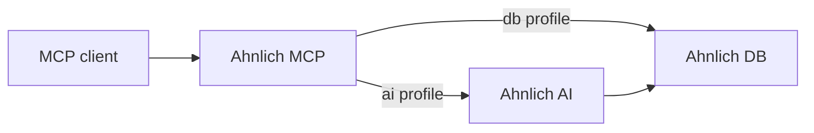

# Ahnlich MCP

Ahnlich MCP gives MCP-compatible agents access to Ahnlich vector storage,
semantic search, and metadata filtering.

It runs locally over stdio and does not require cloud credentials.

## Profiles

| Profile | Input | Required services |
| --- | --- | --- |
| `ai` | Raw text | Ahnlich AI and Ahnlich DB |
| `db` | Precomputed embeddings | Ahnlich DB |

Use `ai` when the agent should work with text. Ahnlich AI generates the
embeddings before storing them in Ahnlich DB.

Use `db` when your application already generates embeddings.

## Exposed tools

Both profiles expose the same 11 tool names.

| Tool | Purpose | Access |
| --- | --- | --- |
| `ping` | Check whether the configured Ahnlich service is reachable | Read |
| `server_info` | Inspect the service version, address, and memory information | Read |
| `create_store` | Create a text or embedding store | Write |
| `list_stores` | List existing stores | Read |
| `drop_store` | Delete a store and all its entries | Destructive |
| `store_entries` | Store text or precomputed embeddings with metadata | Write |
| `similarity_search` | Find entries that are semantically or numerically similar | Read |
| `get_by_metadata` | Retrieve entries matching indexed metadata | Read |
| `delete_by_metadata` | Delete entries matching indexed metadata | Destructive |
| `create_predicate_index` | Index metadata keys for filtering | Write |
| `drop_predicate_index` | Remove metadata indexes | Destructive |

The inputs for `create_store`, `store_entries`, and `similarity_search` depend
on the active profile.

See the [tool reference](/docs/components/ahnlich-mcp/tools) for complete inputs, return types, examples,
and agent guidance.

## Current scope

The AI profile currently accepts text. Direct image and audio tools are not yet
available through Ahnlich MCP.

Ahnlich MCP connects to existing Ahnlich services; it does not start them
automatically.

## Next steps

- [Install Ahnlich MCP](/docs/components/ahnlich-mcp/installation)
- [Review the tool reference](/docs/components/ahnlich-mcp/tools)
- [Install Ahnlich services](/docs/getting-started/installation)