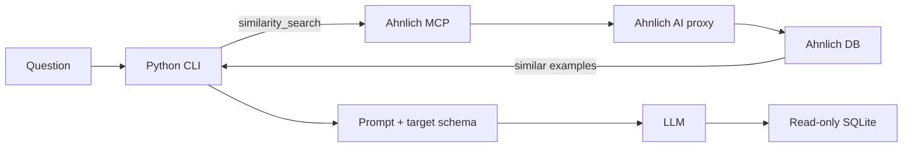

Language models often produce better SQL when the prompt contains a relevant
question-to-SQL example. The problem is choosing the example before the model
answers the new question.

In this guide, we use [Ahnlich](https://ahnlich.dev/) as a semantic example
store and access it through its MCP server. The complete implementation is in
[ahnlich-icl](https://github.com/osobotu/ahnlich-icl).

## What you will build

The application follows one explicit path:

1. Store Spider training questions in Ahnlich, with their SQL as metadata.
2. Send a new natural-language question to Ahnlich through MCP.
3. Add the five most similar question-to-SQL pairs to the prompt.
4. Generate SQL for the target database schema.
5. Execute the query against a read-only SQLite database.



## Prerequisites

You need:

- Python 3.11–3.13 and [uv](https://docs.astral.sh/uv/)
- Docker with Docker Compose
- [Spider 1.0](https://yale-lily.github.io/spider)
- a Groq API key, or another OpenAI-compatible model endpoint

Clone and install the project:

```bash
git clone https://github.com/osobotu/ahnlich-icl.git
cd ahnlich-icl
uv sync --prerelease=allow
cp .env.example .env
```

Set the model configuration in `.env`:

```dotenv
SPIDER_DIR=data/spider
AHNLICH_STORE_NAME=spider_examples

GROQ_API_KEY=replace-me
LLM_BASE_URL=https://api.groq.com/openai/v1
LLM_MODEL=openai/gpt-oss-20b
LLM_REASONING_EFFORT=low
```

Place Spider in this layout:

```text
data/spider/
├── train_spider.json
├── dev.json
├── tables.json
└── database/
    └── <db_id>/
        └── <db_id>.sqlite
```

## 1. Start Ahnlich

The included Compose file starts Ahnlich AI and Ahnlich DB with persistence:

```bash
docker compose up -d --wait
```

Check that the MCP server can reach both services:

```bash
uvx ahnlich-mcp doctor --profile ai
```

The `ai` profile accepts raw text and lets Ahnlich create the embeddings. The
project therefore needs no separate embedding library.

## 2. Connect Python to Ahnlich MCP

`src/ahnlich_icl/ahnlich_mcp.py` starts the MCP server over standard input and
output, then opens a normal MCP client session:

```python
from contextlib import asynccontextmanager

from mcp import ClientSession, StdioServerParameters
from mcp.client.stdio import stdio_client


@asynccontextmanager
async def open_ahnlich_session():
    server = StdioServerParameters(
        command="ahnlich-mcp",
        args=["--profile", "ai"],
    )

    async with stdio_client(server) as (reader, writer):
        async with ClientSession(reader, writer) as session:
            await session.initialize()
            yield session
```

All indexing and retrieval operations go through this boundary:

```python
async with open_ahnlich_session() as session:
    result = await session.call_tool(tool_name, arguments)
```

See the [Ahnlich MCP installation guide](/docs/components/ahnlich-mcp/installation)
and [tool reference](/docs/components/ahnlich-mcp/tools) for the available
profiles and payloads.

## 3. Index question-to-SQL examples

For each Spider training example, embed only the natural-language question.
Keep the expected SQL and identifiers in metadata:

```python
def text_entry(example):
    return {
        "content": example.question,
        "metadata": {
            "example_id": example.example_id,
            "db_id": example.db_id,
            "sql": example.sql,
        },
    }
```

At query time we know the new question, but not its SQL.
Including SQL in the stored embedding would make the retrieval experiment
unrealistic.

Store a batch through MCP:

```python
await session.call_tool(
    "store_entries",
    {
        "store_name": "spider_examples",
        "entries": [text_entry(example) for example in examples],
    },
)
```

The repository batches all 7,000 training examples for you:

```bash
uv run --env-file .env python scripts/index_examples.py
```

The Compose volumes preserve the store across restarts. Running
`docker compose down -v` removes it.

## 4. Retrieve demonstrations through MCP

Search with the new question and ask Ahnlich for the nearest five entries:

```python
result = await session.call_tool(
    "similarity_search",
    {
        "store_name": "spider_examples",
        "query": question,
        "top_k": 5,
        "algorithm": "cosine",
    },
)
```

The response contains the original question, its metadata, and a similarity
score. The project reconstructs each result as an example that can be inserted
into the prompt.

Inspect retrieval before involving an LLM:

```bash
uv run --env-file .env python scripts/inspect_retrieval.py \
  "How many singers do we have?"
```

One retrieved training example may look like this:

```text
similarity=0.8170
Question: How many artists do we have?
SQL: SELECT count(*) FROM artist
```

This small inspection step makes poor or redundant retrieval visible instead
of hiding it behind model output.

## 5. Build the Text-to-SQL prompt

Every method uses the same prompt. Only the demonstrations change:

```text
DATABASE SCHEMA

<CREATE TABLE statements for the target database>

EXAMPLE 1

Question:
How many artists do we have?

SQL:
SELECT count(*) FROM artist

TARGET QUESTION

How many singers do we have?

SQL:
```

Only the target database schema is included. Demonstrations contain just the
question and SQL, which keeps the prompt small and the comparison controlled.
The model is called with `temperature=0` and instructed to return SQL only.

## 6. Put retrieval, generation, and execution together

The core of `src/ahnlich_icl/agent.py` is intentionally small:

```python
matches = await similarity_search(store_name, question, k=5)

retrieved_examples = tuple(
    match for match in matches if match.similarity >= 0.5
)

sql = generate_sql(
    question,
    schema,
    demonstrations=[match.example for match in retrieved_examples],
)

columns, rows, truncated = _execute_read_only(database_path, sql)
```

If no example reaches the `0.5` threshold, generation continues zero-shot.
This is useful in an interactive application: weak context is optional, not an
error.

Run the CLI against any Spider database, for example `world_1`:

```bash
uv run --env-file .env python -m ahnlich_icl.agent_cli world_1
```

Then ask a question:

```text
Question> Which city has the largest population?
```

The CLI prints the retained examples and scores, the generated SQL, and the
result rows.

:::warning
Executing model-generated SQL is risky. This demo opens SQLite in read-only
mode, stops long-running queries, and limits displayed rows. Use narrowly
scoped database credentials and additional safeguards outside a demo.
:::

## 7. Check whether retrieval actually helps

Do not assume semantic examples are better. The pilot compares the same model,
schema, prompt, dataset, and evaluator under three conditions:

- **Zero-shot:** no examples
- **Random 5-shot:** five seeded random examples
- **Ahnlich semantic 5-shot:** the top five MCP search results

Run 30 development questions per Spider difficulty:

```bash
uv run --env-file .env python scripts/run_experiment.py \
  --per-difficulty 30 \
  --delay-seconds 15 \
  --output results/pilot.jsonl
```

The pilot's test-suite accuracy was 58.3% zero-shot, 56.7% random 5-shot, and
62.5% with Ahnlich semantic 5-shot. Semantic retrieval helped most on medium
and hard questions, had no advantage on extra-hard questions, and sometimes
made a previously correct answer wrong.

Each JSONL record keeps the question, gold SQL, generated SQL, selected
examples, scores, and evaluation result for later inspection.

## Connect another MCP-capable agent

The Python CLI controls when retrieval happens. You can also expose the same
tools to an MCP-capable host such as Codex:

```bash
codex mcp add ahnlich -- uvx ahnlich-mcp --profile ai
codex mcp list
```

After indexing, you can register it in read-only mode so the host can search
but cannot alter the example bank:

```bash
codex mcp add ahnlich \
  --env AHNLICH_MCP_READ_ONLY=1 \
  -- uvx ahnlich-mcp --profile ai
```

Tell the agent exactly when to call `similarity_search` and how to use the
returned metadata. Tool selection is a separate behavior from retrieval
quality, so keep it explicit when you want a controlled comparison.

## Extend the pattern

Text-to-SQL is only one example of retrieval-guided in-context learning. The
same loop works when you have a bank of validated input-output pairs:

| Task | Embedded content | Metadata used in the prompt |
| --- | --- | --- |
| Support | Customer question | Approved response |
| Classification | Input text | Label and rationale |
| Code generation | Natural-language task | Reviewed code |
| Incident response | Symptom description | Confirmed diagnosis and fix |

